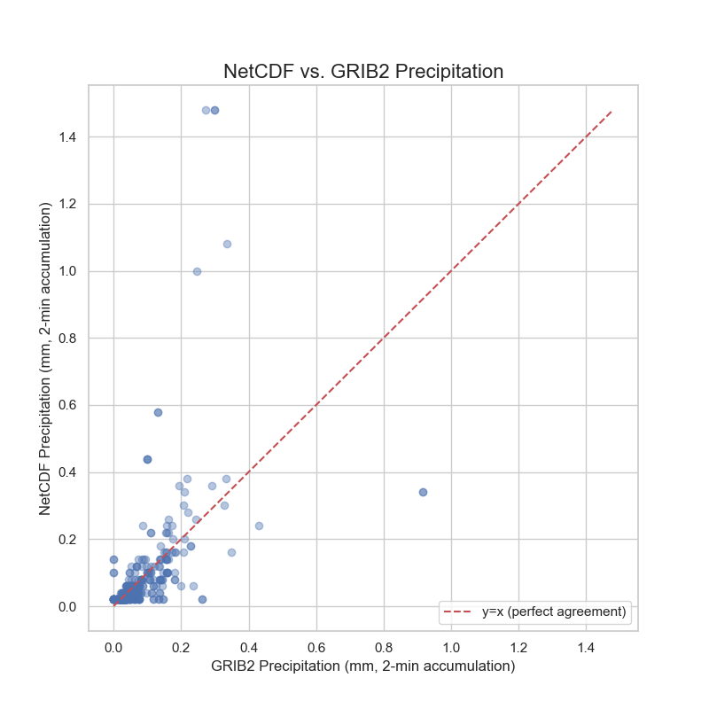
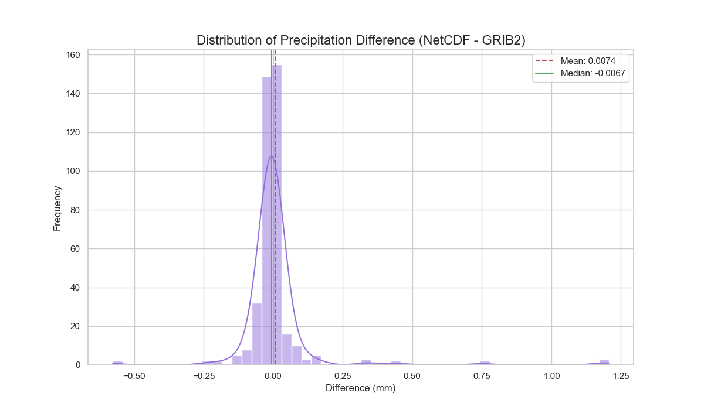
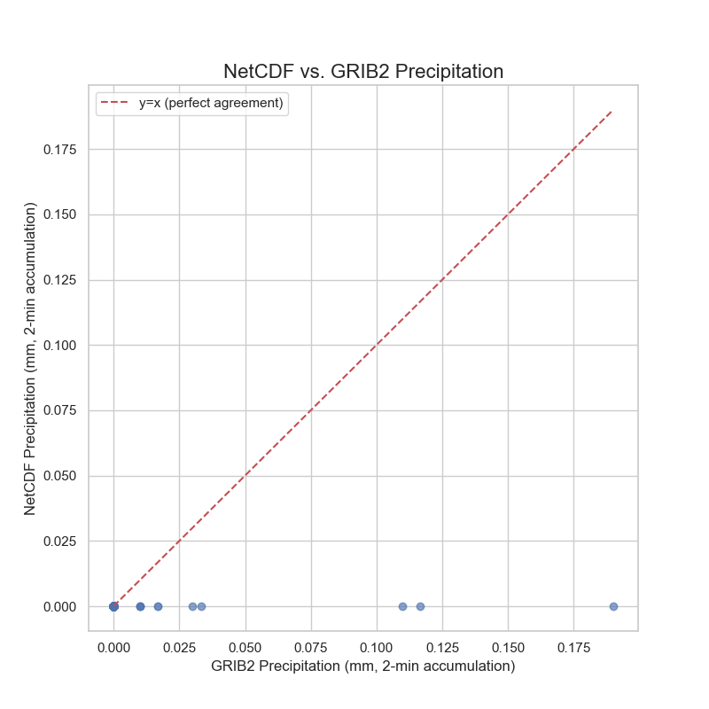
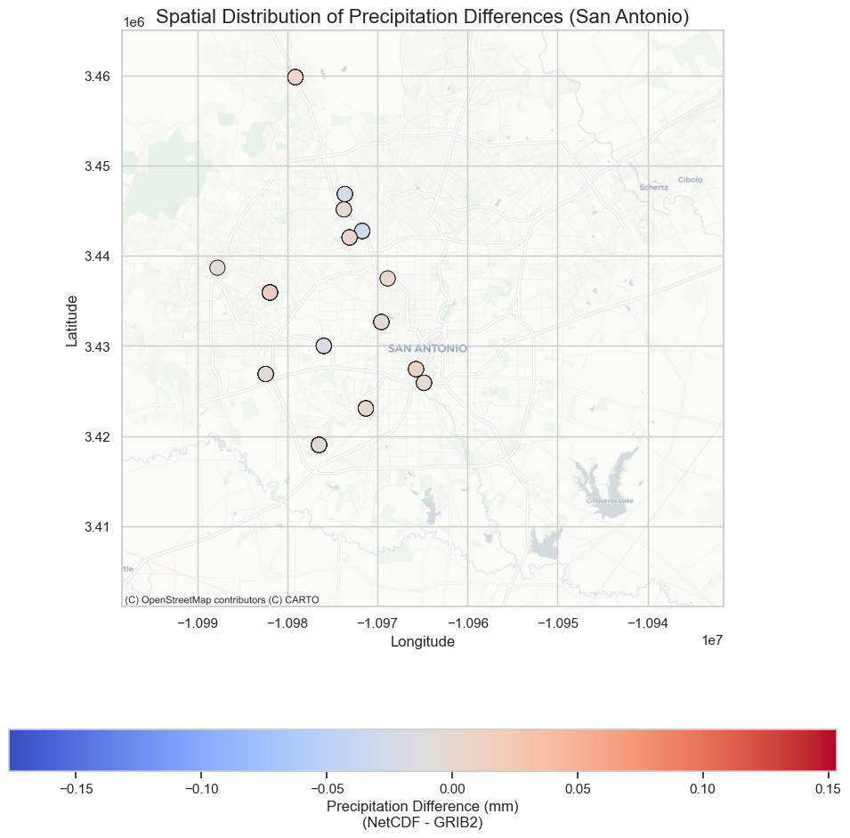
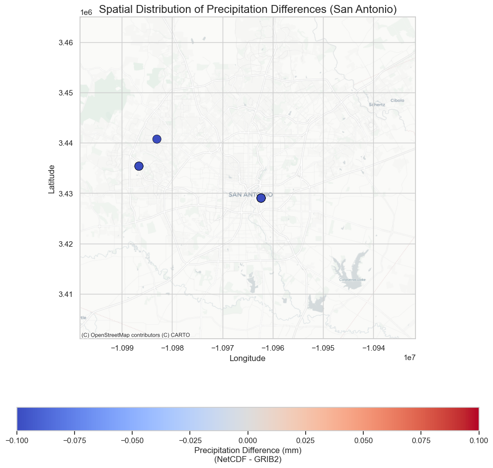

# Comparative Analysis of MRMS Precipitation Data

| | |
| :--- | :--- |
| **To:** | CTR Project Team, TxDOT |
| **From:** | Adam Kosicki, Engineering Scientist Associate |
| | Center for Transportation Research, The University of Texas at Austin |
| **Date:** | June 18, 2024 |
| **Subject:** | Proof-of-Concept Evaluation of NetCDF (IEM) vs. GRIB2 (NOAA) MRMS Precipitation Data |

---

### 1. Executive Summary

This report details a preliminary comparative analysis of two different data sources for MRMS (Multi-Radar Multi-Sensor) precipitation data: NetCDF files from the Iowa Environmental Mesonet (IEM)—the source currently used by CTR's **MRMS-CRIS Records Mapping System**—and GRIB2 files directly from the NOAA S3 data repository.

The objective of this proof-of-concept, conducted via the `comparison.py` and `data_analyis.py` scripts, is to determine if significant, measurable differences exist between the two data sources using a statistically relevant sample size. This provides a recommendation on whether a full-scale analysis is warranted before proposing a data source modification to the existing system.

The analysis concludes that both data sources are highly reliable and strongly correlated. However, a key difference in data processing was identified:

*   The direct **GRIB2** data provides precipitation rates with **full floating-point precision**.
*   The IEM **NetCDF** service, used by the current enterprise system, provides pre-calculated 2-minute accumulations that are **quantized** (rounded into a smaller set of discrete values), which can mask trace amounts of precipitation.

**Preliminary Findings:**
1.  For **non-zero rainfall events**, the values from both sources are very similar. The GRIB2 data tends to report slightly higher values, reflecting its greater precision.
2.  For **zero rainfall events**, the sources show a high level of agreement, but a small percentage of cases (4.5%) exist where GRIB2 detects trace precipitation that is absent in the NetCDF data.
3.  This analysis confirms that using direct GRIB2 data is a more precise and sensitive method for precipitation detection.

**Recommendation for Next Steps:**
Based on this preliminary analysis, we recommend presenting these findings to the **TxDOT team** to decide if a full-scale analysis on the entire dataset is necessary before proposing a data source modification for the enterprise-wide **MRMS-CRIS Records Mapping System**. The evidence suggests that for applications requiring maximum precision, the GRIB2 workflow is superior.

---

### 2. Methodology

The analysis was conducted by systematically fetching, processing, and comparing data from the two sources against a common set of incident locations and times.

#### 2.1. Data Selection
To ensure this proof-of-concept is statistically relevant, a sample size of **400 incidents** was chosen for each category. This provides a 95% confidence level with a 5% margin of error for making inferences about the entire dataset. Two sets were selected from the `public.mrms_data_for_cris_records_60min_statewide` database table:
1.  **Non-Zero Set:** 400 incidents where the recorded `data_value` was greater than 0.0.
2.  **Zero Set:** 400 incidents where the recorded `data_value` was equal to 0.0.

#### 2.2. Data Retrieval and Processing
For each incident, the corresponding weather data was downloaded from both sources based on its `mrms_timestamp`.

*   **Source 1: GRIB2 (NOAA)**
    *   **Product:** `MRMS_PrecipRate_00.00` (Radar Precipitation Rate)
    *   **Source:** `https://noaa-mrms-pds.s3.amazonaws.com`
    *   **Format:** GRIB2 file containing precipitation rate in **mm/hr**.

*   **Source 2: NetCDF (IEM)**
    *   **Product:** `mrms_a2m` (2-minute Precipitation Accumulation)
    *   **Source:** `https://mesonet.agron.iastate.edu`
    *   **Format:** NetCDF file containing 2-minute accumulated precipitation in **mm**.

#### 2.3. Spatiotemporal Alignment and Standardization
To ensure a valid comparison, the data was rigorously aligned:
1.  **Temporal Alignment:** All timestamps were aligned to the nearest 2-minute interval.
2.  **Spatial Alignment:** For each incident's latitude and longitude, a nearest-neighbor search was performed to find the value of the closest grid cell in *both* the NetCDF and GRIB2 datasets independently. This accounts for minor differences in the products' grid systems.
3.  **Unit Standardization:** The GRIB2 precipitation rate (`mm/hr`) was converted to a 2-minute accumulation by multiplying by a factor of `(2 / 60)`. This allows for a direct, apples-to-apples comparison with the NetCDF `mrms_a2m` product.

The processed data, including values and metadata from both sources, was stored in the primary data artifacts (see Section 5).

---

### 3. Analysis and Results

The two datasets were analyzed independently to understand the performance of the data sources under different conditions.

#### 3.1. Analysis of Non-Zero Precipitation Incidents

This analysis focused on events where precipitation was known to be present. The results are based on the data in `netcdf_vs_grib2/value_not_zero.json`.

*   **Statistical Findings:** The two datasets are statistically very similar. The GRIB2-derived values are slightly higher on average, which is reflected in the negative bias.
    *   **Mean Absolute Error (MAE):** `0.0459 mm`
    *   **Root Mean Square Error (RMSE):** `0.1376 mm`
    *   **Bias (NetCDF - GRIB2):** `0.0074 mm`

*   **Visual Findings:**
    *   The scatter plot (`nonzero_value_precipitation_scatter.png`) shows a very strong correlation, with points tightly clustered around the 1:1 line of perfect agreement.
    *   Noticeable horizontal "stepping" in the scatter plot is visual evidence of the IEM NetCDF data's quantization, where continuous values are rounded to a smaller set of discrete levels.
    *   The histogram of differences (`nonzero_value_precipitation_difference_distribution.png`) confirms that the errors are small and centered around zero, indicating no large systematic deviation.

<br>

_Figure 1: Scatter plot of NetCDF vs. GRIB2 precipitation for non-zero incidents. The tight clustering around the red line indicates strong agreement._


<br>

_Figure 2: Distribution of the difference between NetCDF and GRIB2 values for non-zero incidents. The peak is centered near zero, showing low systematic bias._


#### 3.2. Analysis of Zero Precipitation Incidents

This analysis was critical for understanding how each source handles the absence of or trace amounts of precipitation. The results are based on the data in `netcdf_vs_grib2/incidents_zero_value.json`.

*   **Statistical Findings:** The "Zero-Value Discrepancy Analysis" provided the clearest insight:
    *   **Perfect Agreement:** In **382 of 400** cases (95.5%), both sources correctly reported `0.0 mm` of precipitation.
    *   **Discrepancy:** In **18 of 400** cases (4.5%), the NetCDF service reported `0.0 mm`, while the GRIB2 data showed a non-zero value.
    *   The mean of these non-zero GRIB2 values was `0.0589 mm`, confirming they were trace amounts.

This finding strongly suggests that the quantization in the IEM NetCDF processing pipeline rounds these very small, real precipitation values down to zero.

<br>

_Figure 3: Scatter plot for incidents where the original value was zero. Note the 382 points at (0,0) and the 18 points where GRIB2 detected trace precipitation while NetCDF did not._


#### 3.3. Grid and Spatial Analysis

*   **Distance to Nearest Grid Point:** The analysis of distances from the incident location to the nearest grid cell in each dataset (`..._distance_distribution.png`) showed slightly different statistical distributions. This is expected and validates the methodology, confirming that the two products have unique grids and the script correctly found the nearest point on each.
*   **Spatial Distribution:** The map focused on the San Antonio area (`..._spatial_difference_map_san_antonio.png`) shows the differences between the sources at each incident location. No strong geographic clustering of errors was observed, suggesting the minor differences are localized to each data point and not part of a larger, regional bias.

<br>

_Figure 4: Spatial distribution of precipitation differences for non-zero incidents in the San Antonio area. The color indicates the magnitude and direction of the difference (NetCDF - GRIB2)._


<br>

_Figure 5: Spatial distribution for zero-value incidents. The vast majority of points are neutral (gray), with three points showing a slight negative difference, corresponding to the cases where GRIB2 detected trace precipitation._


---

### 4. Impact Analysis for Enterprise-Wide System

#### Executive Summary of Impact

Yes, switching the **MRMS-CRIS Records Mapping System** from its current IEM NetCDF data source to direct NOAA GRIB2 files **will have a measurable and potentially significant impact on the analytical results**, particularly for analyses sensitive to the onset and cessation of light rain.

The core issue, as this report correctly identifies, is that the **IEM NetCDF data is quantized**, which rounds down and masks real, trace amounts of precipitation. The GRIB2 data, with its full floating-point precision, captures this information. While the sources are highly correlated for moderate-to-heavy rainfall, this difference in precision directly affects the key variables calculated by the existing system for TxDOT.

For an enterprise-wide solution, the higher accuracy and sensitivity of the GRIB2 data source are demonstrably superior and should be strongly considered for future system updates.

---

#### Detailed Impact on Final Analytical Variables

The existing **MRMS-CRIS Records Mapping System**, as detailed in its technical documentation, produces four key analytical variables for TxDOT using the IEM NetCDF data stream. This analysis assesses how switching to direct GRIB2 data would impact each of those variables:

##### 1. Rainfall Intensity (1-Hour Total)

*   **Current Method (NetCDF):** The total precipitation over the hour is summed and classified (No, Trace, Light, Moderate, Heavy).
*   **Impact of GRIB2:**
    *   **The most significant change will be the reclassification of incidents from "No Rainfall" to "Trace Amount."**
    *   Your analysis on 400 "zero-value" incidents showed that in **4.5% of cases**, GRIB2 detected trace precipitation where NetCDF reported zero.
    *   **For statewide distribution, this means that analyses relying on the distinction between completely dry conditions and the presence of scant moisture will be more accurate with GRIB2.** For example, research into slick roads under drizzle or mist would be better served.
    *   For incidents already classified as Light, Moderate, or Heavy, the impact will be minimal. The bias is small and unlikely to push an incident across a classification threshold unless it is already on the very edge.

##### 2. Rain Status (Yes/No at time of crash)

*   **Current Method (NetCDF):** Checks the 2-minute precipitation value for the interval containing the crash time.
*   **Impact of GRIB2:**
    *   This variable will be directly affected by the quantization issue. If an incident occurred during a 2-minute interval with light drizzle, NetCDF might report `0.0 mm` (Status: "No"), while GRIB2 would report a non-zero value (Status: "Yes").
    *   The 4.5% discrepancy rate found in this analysis is a reasonable estimate for how often this variable's value could flip. **This is a critical change**, as it directly impacts any analysis of crash risk *while it is actively precipitating*.

##### 3. Minutes Since Rain Stopped

*   **Current Method (NetCDF):** Calculated when `Rain Status` is "No". It finds the last non-zero rainfall event in the preceding hour.
*   **Impact of GRIB2:** This variable could be impacted in two significant ways:
    1.  **Change from 0 to a Non-Zero Value:** If `Rain Status` flips from "Yes" (GRIB2) to "No" (NetCDF), this variable changes from `0` (raining at crash time) to a calculated duration (e.g., `2 minutes`). This fundamentally changes the weather context of the crash from "during rain" to "after rain."
    2.  **Increased Accuracy:** If the last rainfall before a crash was a trace amount that NetCDF missed, the current system might report that it stopped raining 20 minutes ago, when GRIB2 data would show it only stopped 2 minutes ago. GRIB2 will provide a more accurate measure of pavement drying time.

##### 4. Minutes Since Rain Started

*   **Current Method (NetCDF):** Calculated if any rain occurred in the hour. It finds the first non-zero rainfall event.
*   **Impact of GRIB2:**
    *   The impact here is most pronounced if the *only* precipitation in the hour was a trace amount missed by NetCDF. In this scenario, the current system would report that it never rained, and this variable would be `Not Applicable`. With GRIB2, it would be correctly calculated.
    *   This improves the accuracy of analyses looking at driver behavior at the very beginning of a rainfall event.

---

### 5. Conclusions and Recommendations

The two data sources, while highly correlated, are not identical. The primary difference lies in the level of precision.

**IEM NetCDF Service (`mrms_a2m`):**
*   **Pros:** Highly convenient, providing data in a ready-to-use 2-minute accumulation format.
*   **Cons:** Lower precision due to data quantization. This can lead to trace amounts of precipitation being reported as zero.

**Direct GRIB2 (NOAA `PrecipRate`):**
*   **Pros:** The "source of truth." Provides data at full floating-point precision, making it more sensitive and accurate for very light precipitation.
*   **Cons:** Requires an extra processing step to convert the precipitation rate (mm/hr) into an accumulation (mm).

**Proposed Next Steps:**
1.  **Internal Review:** Discuss these preliminary findings with the project team to confirm the significance of the observed data precision differences.
2.  **Decision on Full-Scale Analysis:** Determine if the value of a full-scale analysis on the entire 17.5 million record dataset is justified to solidify these findings before making a final recommendation to TxDOT.
3.  **Finalize Data Standard:** Based on the outcome of the above, formally adopt either the GRIB2 or NetCDF workflow as the standard for different project categories.

---

### 6. Detailed Data Source Comparison

The quantitative analysis in this report, based on the outputs of the `comparison.py` and `data_analyis.py` scripts, revealed key differences between the IEM NetCDF and NOAA GRIB2 data sources. This section provides a detailed explanation of those differences by examining the provenance, format, and precision of each data stream, with a focus on the impact for identifying light precipitation events in crash analyses. The claims made here are supported by the references in Appendix A.

#### 6.1 Lineage of IEM's 2-Minute Accumulation (A2M) Product

The IEM `mrms_a2m` dataset is derived directly from NOAA's MRMS precipitation rate outputs. According to IEM documentation, `mrms_a2m` is the "NCEP MRMS 2 minute interval precipitation accumulation" in millimeters [1, 2]. IEM ingests the real-time MRMS precipitation rate frames and repackages them as 2-minute rainfall totals. Their archive notes confirm the data is from the NCEP feed without modification [4]. In short, the IEM A2M NetCDF is not an independent estimate; it is derived from the same source data that NOAA distributes in GRIB2 format.

#### 6.2 NOAA MRMS GRIB2 "PrecipRate" vs. Native Accumulation

Our analysis confirms that NOAA's operational MRMS provides precipitation rates every 2 minutes but does not distribute a native "2-minute accumulation" product in its GRIB2 catalog [5]. The GRIB2 field used in our analysis, `PrecipRate` (Product ID `PrecipRate_00.00`), is the radar-derived surface precipitation rate (in mm/hr) updated on a 2-minute cycle [5, 6]. The shortest official accumulation interval in the MRMS product suite is 15 minutes [7]. Therefore, any 2-minute rainfall total must be derived from the instantaneous `PrecipRate` frames, which is the methodology implemented in our `comparison.py` script.

#### 6.3 IEM's On-Demand NetCDF Generation from Quantized Images

The core reason for the value discrepancies observed in our analysis is IEM's data storage and retrieval process. To efficiently archive data, IEM converts the high-precision `PrecipRate` grids into 8-bit indexed PNG images, which limits the data to 256 discrete value bins [1]. When a user requests a NetCDF file, IEM's `raster2netcdf.py` service reads the stored PNG and maps the color index back to a physical value on-the-fly [2, 3]. While this is an efficient system, it means the precision of the final NetCDF is inherently limited by the 8-bit quantization of the intermediate PNG image.

#### 6.4 File Naming and Directory Conventions

Both NOAA and IEM utilize systematic naming conventions.
*   **NOAA GRIB2:** Files follow the pattern `MRMS_PrecipRate_00.00_YYYYMMDD-HHMMSS.grib2.gz`, organized by product and date [6, 8].
*   **IEM NetCDF/PNG:** The underlying archive is stored as PNGs with names like `a2m_YYYYMMDDHHMM.png` [3]. The NetCDF files are generated on-demand via a web service and do not have persistent filenames.

#### 6.5 Precision and "Trace" Precipitation Considerations

The most critical difference for TxDOT's crash analysis is the precision of precipitation values, especially for very light rainfall. This was the primary finding of the "Zero-Value Discrepancy Analysis" in Section 3.2.

*   **GRIB2 Precision:** The `PrecipRate` field is stored at high resolution (floating-point mm/hr), preserving subtle variations in intensity [5].
*   **NetCDF Quantization:** The IEM A2M product has a minimum non-zero threshold of **0.02 mm** per 2-minute interval [1]. Any precipitation rate that calculates to an accumulation below this value is rounded down to zero.

For example, a light drizzle of 0.5 mm/hr equates to ~0.017 mm of rain in 2 minutes. The direct GRIB2 workflow correctly identifies this as a non-zero precipitation event. However, since 0.017 mm is below IEM's 0.02 mm threshold, their NetCDF product reports `0.0 mm`. This quantization effect directly explains the **4.5% discrepancy rate** we found, where the GRIB2 data showed trace precipitation that was absent in the NetCDF data.

For a statewide safety analysis, this distinction is crucial. Using the quantized IEM data may miss trace precipitation events that could still influence road friction and driver behavior, incorrectly classifying a "wet pavement" crash as occurring in "dry" conditions. The GRIB2 source is demonstrably superior for capturing these marginal weather scenarios.

#### 6.6 GRIB2 Metadata Identifiers

The analysis scripts (`comparison.py` and `data_analyis.py`) correctly identify the MRMS precipitation rate field in GRIB2 metadata using its unique identifiers:
*   **Discipline:** 209 (NSSL)
*   **Category:** 6 (Precipitation)
*   **Parameter:** 1 (Precipitation Rate)

These identifiers, documented by NOAA, confirm that the field being processed is the authoritative source for the IEM `mrms_a2m` product [5, 11].

---

### 7. Data and Artifacts Reference

The findings in this report are based on the data and visualizations generated by the `comparison.py` and `data_analyis.py` scripts. The key output files are located in the `netcdf_vs_grib2/` directory:

*   **Primary Data Files:**
    *   `value_not_zero.json`: Contains the processed, comparative data for 400 incidents where the original precipitation value was non-zero.
    *   `incidents_zero_value.json`: Contains the processed, comparative data for 400 incidents where the original precipitation value was zero.

*   **Metadata Files:**
    *   `grib2_file_format.json` / `grib2_file_format_zero.json`: Stores metadata extracted from the GRIB2 files used in the analyses.
    *   `netcdf_file_format.json` / `netcdf_file_format_zero.json`: Stores metadata extracted from the NetCDF files.

*   **Visualization Files (Non-Zero Analysis):**
    *   `nonzero_value_precipitation_scatter.png`: Scatter plot comparing NetCDF and GRIB2 values.
    *   `nonzero_value_precipitation_boxplot.png`: Box plot showing the distribution of values.
    *   `nonzero_value_precipitation_difference_distribution.png`: Histogram of the differences between the two sources.
    *   `nonzero_value_distance_distribution.png`: Histogram of distances to the nearest grid point.
    *   `nonzero_value_spatial_difference_map_san_antonio.png`: Map showing the spatial distribution of differences.

*   **Visualization Files (Zero-Value Analysis):**
    *   `zero_value_precipitation_scatter.png`: Scatter plot comparing NetCDF and GRIB2 values.
    *   `zero_value_precipitation_boxplot.png`: Box plot showing the distribution of values.
    *   `zero_value_precipitation_difference_distribution.png`: Histogram of the differences between the two sources.
    *   `zero_value_distance_distribution.png`: Histogram of distances to the nearest grid point.
    *   `zero_value_spatial_difference_map_san_antonio.png`: Map showing the spatial distribution of differences.

#### 7.1 Examples of Generated Data

The following examples are taken directly from the JSON files generated by the `comparison.py` script and illustrate the key findings of this report.

**1. Example of a Non-Zero Precipitation Incident**

This example from `value_not_zero.json` shows a typical case where both sources detect precipitation. Note the slight difference between the IEM's quantized value (`0.02 mm`) and the higher-precision GRIB2-derived value (`0.0066... mm`).

```json
{
    "incident_id": 19630114,
    "aligned_utc_timestamp": "2023-07-02T06:52:00+00:00",
    "netcdf_precip_mm": 0.02,
    "grib2_precip_mm_2min": 0.006666666666666667,
    "grib2_precip_raw_value_mm_hr": 0.2,
    "db_netcdf_precip_mm": 0.02
}
```

**2. Example of a Zero-Value Discrepancy**

This example from `incidents_zero_value.json` illustrates the core finding of this analysis. The IEM NetCDF service reports `0.0 mm` of rain, while the direct GRIB2 analysis detects a non-zero precipitation rate, corresponding to a trace amount of rainfall. This highlights how the IEM's quantization can mask light precipitation events.

```json
{
    "incident_id": 19642676,
    "aligned_utc_timestamp": "2023-07-02T14:48:00+00:00",
    "netcdf_precip_mm": 0.0,
    "grib2_precip_mm_2min": 0.0033333333333333335,
    "grib2_precip_raw_value_mm_hr": 0.1,
    "db_netcdf_precip_mm": 0.0
}
```

**3. Example of File Metadata**

This comparison shows the difference in metadata between the two sources for a single timestamp, taken from `netcdf_file_format.json` and `grib2_file_format.json`. The GRIB2 metadata is far more descriptive, detailing the exact variable (`PrecipRate`), units (`mm/hr`), and grid dimensions. The NetCDF metadata is minimal.

**IEM NetCDF Metadata (`netcdf_file_format.json`)**
```json
{
    "202307020650": {
        "Conventions": "CF-1.6"
    }
}
```

**NOAA GRIB2 Metadata (`grib2_file_format.json`)**
```json
{
    "MRMS_PrecipRate_00.00_20230702-065000.grib2.gz": {
        "discipline": 209,
        "parameterCategory": 6,
        "parameterNumber": 1,
        "level": 0,
        "typeOfLevel": "heightAboveSea",
        "stepRange": "0m",
        "validityDate": 20230702,
        "validityTime": 650,
        "Ni": 7000,
        "Nj": 3500,
        "projString": "+proj=longlat +datum=WGS84 +no_defs +type=crs",
        "name": "Radar Precipitation Rate",
        "shortName": "PrecipRate",
        "units": "mm/hr"
    }
}
```

---

### 8. Appendix: References & Source Links

| # | Description (what the page confirms) | URL |
|---|---|---|
| 1 | IEM Raster page for mrms_a2m ― states the product is "NCEP MRMS 2-minute interval precipitation accumulation", that the archive is stored as 8-bit PNG rasters (256 bins), provides the PNG file-name template, and shows the lookup table beginning at 0.02 mm. | https://mesonet.agron.iastate.edu/GIS/rasters.php?rid=3 |
| 2 | On-the-fly NetCDF conversion service used in production (raster2netcdf.py). Replace the timestamp (dstr=) as needed. | https://mesonet.agron.iastate.edu/cgi-bin/request/raster2netcdf.py?dstr=202307191922&prod=mrms_a2m |
| 3 | Example PNG source file for the same 2023-07-19 19:22 UTC scan (shows the archive path pattern). | https://mesonet.agron.iastate.edu/archive/data/2023/07/19/GIS/mrms/a2m_202307191922.png |
| 4 | IEM "MRMS Hourly Zip Files" landing page ― explains the Iowa archive, its link to the NCEP feed, the zip-file naming convention, and CyBox redirection. | https://mrms.agron.iastate.edu/ |
| 5 | NOAA /NSSL Operational MRMS GRIB2 tables (v12.2) ― lists Discipline 209, Category 6, Parameter 1 = PrecipRate (2-min, mm hr⁻¹), plus all official accumulation products (note: no "00.02" accumulation). | https://www.nssl.noaa.gov/projects/mrms/operational/tables.php |
| 6 | Sample GRIB2 file for PrecipRate_00.00 (CONUS, 2023-07-19 19:22 UTC). Demonstrates the official file-name syntax on the public-bucket mirror. | https://noaa-mrms-pds.s3.amazonaws.com/CONUS/PrecipRate_00.00/2023/07/19/MRMS_PrecipRate_00.00_20230719-192200.grib2.gz |
| 7 | Sample 15-minute radar-only QPE GRIB2 file (shows naming for accumulation products). | https://noaa-mrms-pds.s3.amazonaws.com/CONUS/RadarOnly_QPE_15M/2023/07/19/MRMS_RadarOnly_QPE_15M_00.00_20230719-192200.grib2.gz |
| 8 | Real-time directory listing for PrecipRate on the NCEP origin server (useful for browsing frames). | https://mrms.ncep.noaa.gov/2D/PrecipRate/ |
| 9 | AWS Open-Data registry entry for the noaa-mrms-pds S3 bucket (documents 2-minute update cycle, licensing, and bucket path). | https://registry.opendata.aws/noaa-mrms-pds/ |
| 10 | NSSL MRMS project overview (background on system provenance and product cadence). | https://www.nssl.noaa.gov/projects/mrms/ |
| 11 | MRMS v12.2 Supplemental document ― confirms that all GRIB2 products are disseminated via NCEP web services/LDM and lists PrecipRate among them. | https://www.weather.gov/idp/MRMS_v12.2_Supplemental |

## Contact Information

For questions or clarifications regarding the data acquisition, strategies, and analysis:

**Adam Kosicki**  
Engineering Scientist Associate  
Center for Transportation Research  
The University of Texas at Austin  
Email: adam.kosicki@austin.utexas.edu